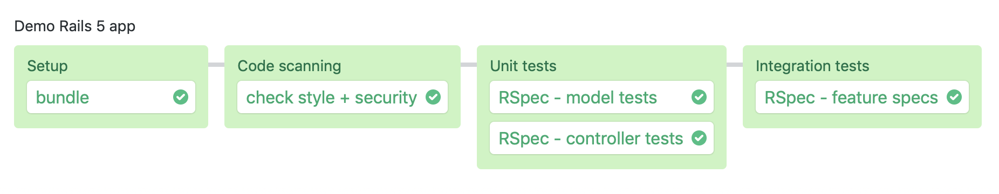

# Semaphore demo CI/CD pipeline using Ruby on Rails

This is an example application and CI/CD pipeline showing how to run a Ruby on
Rails project on Semaphore 2.0.

## Local application setup

Ruby version is specified in `.ruby-version`. We recommend using rbenv.

Database engine is Postgres.

```
bundle install --path .bundle
bundle exec rake db:setup

(optionally)
bundle exec rails s
```

Then run code scanning and automated tests as per `.semaphore/semaphore.yml`.

## CI/CD on Semaphore

If you're new to Semaphore, feel free to fork this repository and use it to
[create a project](https://docs.semaphoreci.com/article/63-your-first-project).

The CI pipeline will look like this:



You can follow along with this project by reading the
[documentation](https://docs.semaphoreci.com/article/99-rails-continuous-integration).
Or jump straight into `.semaphore/semaphore.yml`.

You can extend the CI pipeline with Continuous Delivery by implementing a
[promotion](https://docs.semaphoreci.com/article/67-deploying-with-promotions).
Refer to Semaphore documentation for additional deployment examples.

## License

Copyright (c) 2019 Rendered Text

Distributed under the MIT License. See the file LICENSE.md.
